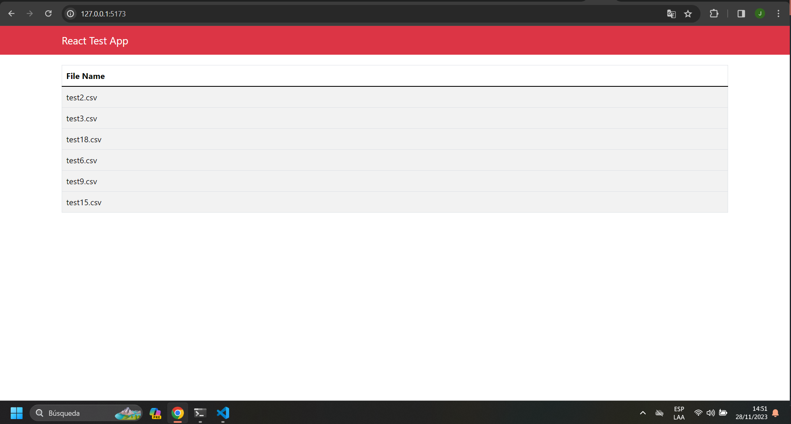
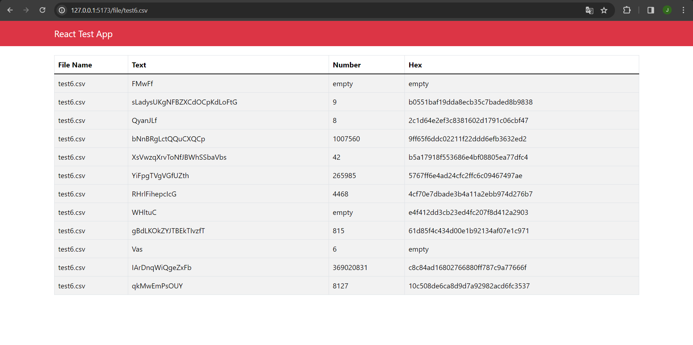

# Instalación y Configuración de Toolbox

Este repositorio contiene un proyecto que fusiona un backend desarrollado en Node.js con Express y un frontend en React utilizando Vite.

## Pasos de Instalación

### Clonar el repositorio

`git clone git@github.com:jesuscabrita/toolbox.git`

### Backend (Node.js con Express)

 Una vez clonado el repositorio, dirígete a la raíz del proyecto que es:  \toolbox\ y ejecuta los siguientes comandos para instalar las dependencias del backend:

`npm install`

 Luego, para iniciar el proyecto en modo de desarrollo, utiliza:

 `npm start`

Esto pondrá en marcha el servidor Express en el puerto predeterminado.

**Ejecutara el servidor**

### Frontend (React con Vite)

**Instalar dependencias del frontend**

Abre otra consola, dirígete al proyecto y accede a la carpeta "client" donde se encuentra el frontend con React:

luego que estes en \toolbox\client

utiliza el comando 

 `npm install`

Luego, para arrancar el proyecto en modo de desarrollo, usa:

 `npm run dev`

Esto iniciará la aplicación React utilizando Vite en modo de desarrollo.

**Compilara la aplicación para producción**

## Test
 los test del proyecto 

### Backend (Test)

Para iniciar las pruebas, asegúrate de estar en la raíz del proyecto y ejecuta:

`npm test`

**Esto ejecutará las pruebas de las rutas del proyecto.**

## Scripts Disponibles

### Backend

- `npm start`: Inicia el servidor de Node.js utilizando nodemon para reinicios automáticos.
- `npm test:integration`: Ejecuta pruebas de integración.
- `npm test`: Ejecuta todas las pruebas.

### Frontend

- `npm run dev`: Inicia el servidor de desarrollo para la aplicación React con Vite.
- `npm run build`: Compila la aplicación React para producción.
- `npm run lint`: Ejecuta ESLint para identificar y corregir problemas en el código.

## Dependencias Principales

### Backend

- **Express**: Framework web para Node.js.
- **axios**: Cliente HTTP para realizar peticiones.
- **cors**: Middleware para habilitar CORS.
- **morgan**: Logger para las solicitudes HTTP.
- **supertest**: Utilidad para pruebas de API HTTP.

### Frontend

- **React**: Biblioteca para construir interfaces de usuario.
- **Vite**: Herramienta de construcción rápida para aplicaciones web modernas.
- **react-router-dom**: Enrutamiento para aplicaciones React.
- **react-bootstrap**: Componentes de Bootstrap para React.
- **axios**: Cliente HTTP para realizar peticiones desde el frontend.

---

### imagenes del proyecto 

